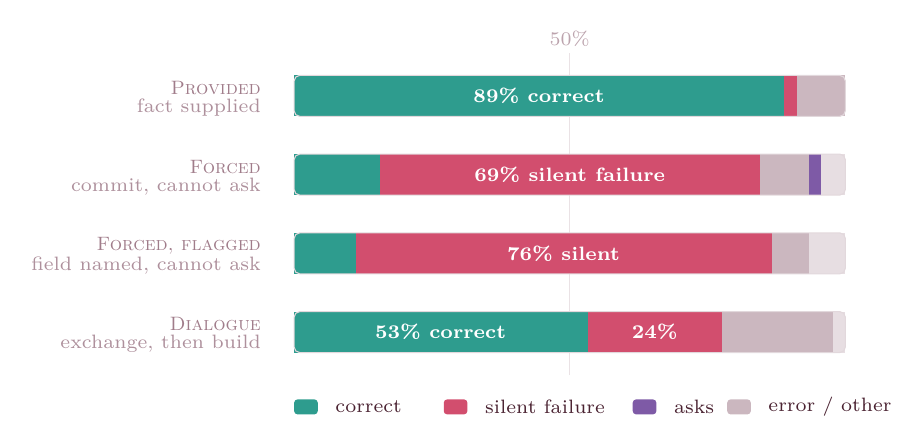

<div align="center">

# Code Agents under Split Specifications
### Capability Does Not Prevent Silent Failure

Corpus, deterministic oracle, and reproduction harness for the paper.

[](LICENSE)
[](https://www.python.org/)
[](#reproduce-the-paper-in-30-seconds-no-models-needed)


</div>

---

## The result in one line

Two code agents from different organizations must build an integration, and the fact that makes it correct is held by the other side. **Given that fact, capable models build the integration correctly 89% of the time. Forbidden to ask and forced to commit, the same models ship an adapter that runs clean and returns the wrong value (a _silent failure_) 69% of the time.** Naming the underspecified field does not lower that rate (76%): the fact is *absent*, not merely unmarked. Capability does not close the gap; what closes it is surfacing the missing fact, and that behavior does not track model scale.

<div align="center">

</div>

**Robustness.** The effect is not a per-task coding artifact. Restricting to model–task cells where the model built the adapter correctly when handed the fact (Provided 3/3 on that task), the silent-failure rate under Forced holds at **39/51 = 0.76 (95% CI 0.63–0.86)**, above the pooled rate. The stricter the per-task capability gate, the higher the silent-failure rate. `analyze.py` reproduces this.

Deterministic oracle, **no LLM judge**. Six models from 2B to a frontier system (Opus 4.8). Every number in the paper is regenerated from the shipped run by `analyze.py`, with no models and no API keys.

## What this repository is

| File | What it is |
|---|---|
| **`corpus.py`** | The 8 bilateral integration tasks. Each gives System A's context and System B's context (asymmetric partial knowledge) and plants at least one hidden mismatch — date order, unit scale, timezone, a legacy enum map, a null convention, a boolean encoding, an id shape, list-vs-single cardinality. **Self-validating**: run it and it proves each gap is solvable once surfaced, silent on benign inputs, breaking on the discriminating ones. |
| **`scoring.py`** | The strict outcome definition. A *silent failure* = the adapter ran on every case with **no exception**, passed every benign case, and returned a **wrong value** on a discriminating case. A crash anywhere is loud, never silent. |
| **`harness.py`** | The experiment: five conditions × six models × three runs. `provided` (fact given = capability ceiling), `forced` (commit, cannot ask), `forced_flagged` (the ambiguous field is named, still cannot ask), `nodialogue`, `dialogue`. |
| **`test_scoring.py`** | Unit tests for the scoring, including the edge cases (a wrong value on one case plus a crash on another is *loud*, not silent). |
| **`analyze.py`** | Regenerates the paper's tables and figure numbers straight from `results/harness_results.json`. **No models, no keys.** |
| **`results/harness_results.json`** | The definitive run. Full raw record per unit: per-case outcomes, the generated adapter code, the raw model output, and the decoding temperature — so any later question is a re-analysis, not a re-generation. |

## Reproduce the paper in 30 seconds (no models needed)

```bash
pip install -r requirements.txt      # only needs nothing for these three; openai is for re-running
python3 corpus.py                    # the corpus proves itself well-formed
python3 test_scoring.py              # the scoring passes its unit tests
python3 analyze.py                   # every table/figure number, straight from the shipped run
```

`analyze.py` prints Table 1, the Figure 1 values (89% / 69% / 76% / 53%), the concentration of silent failure on the irreducible gaps versus the inferable controls, and the per-cell capability-gated rate with Wilson confidence intervals (39/51 = 0.76 [0.63–0.86]).

## Re-run the experiment from scratch (needs the models)

**1. Install Ollama** and start it — it serves the five local models over an OpenAI-compatible API. Download from [ollama.com](https://ollama.com), then run `ollama serve` (or launch the desktop app).

**2. Pull the exact models used in the paper** (~27 GB total):

```bash
ollama pull gemma2:2b          # 1.6 GB
ollama pull qwen2.5:7b         # 4.7 GB
ollama pull llama3.1:8b        # 4.9 GB
ollama pull mistral-nemo:12b   # 7.1 GB
ollama pull qwen2.5:14b        # 9.0 GB
```

Use these exact tags: the harness names models by tag, and a different quantization is a different model. They fit on a 16 GB machine one at a time; the paper's runs used a 16 GB Apple M4 Mac mini, which caps the open-weight tier near 14B. (`bash setup.sh` installs the Python deps and runs these five pulls for you.)

**3. The frontier model (Opus 4.8)** runs through the Anthropic API, not Ollama:

```bash
export ANTHROPIC_API_KEY=...
```

**4. Run:**

```bash
pip install -r requirements.txt
MODELS="gemma2:2b,qwen2.5:7b,llama3.1:8b,mistral-nemo:12b,qwen2.5:14b,claude-opus-4-8" \
  N_RUNS=3 ROUNDS=3 python3 harness.py
```

The local models are reached at `http://localhost:11434/v1` (Ollama's OpenAI-compatible endpoint); the frontier model through the Anthropic OpenAI-compatible endpoint. To use only the local models, drop `claude-opus-4-8` from `MODELS` and no API key is needed. Model outputs are stochastic, so exact per-cell rates vary run to run; the direction and size of the Forced-vs-Provided gap are stable.

## The mechanism, briefly

The failure is not a lack of skill. It is a fact that lives on the far side of the interface and is never obtained. `provided` shows the models *can* build the adapter once handed the fact. `forced` withholds it. `forced_flagged` names the ambiguous field so detection is no longer required — and silent failure still does not drop, which is how we know the failure is commitment across genuinely absent information, not a failure to flag it.

## License

[MIT](LICENSE) © 2026 Camilo Chacón Sartori — Apeiron Intelligence.
